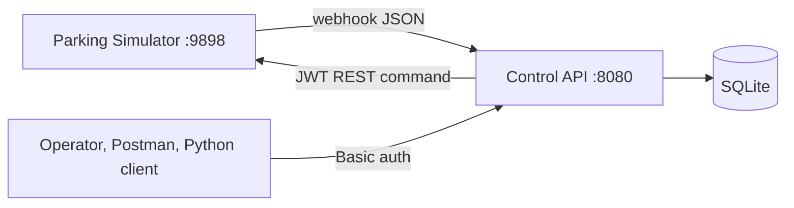

# Grand Park Auto Control System

Participant-side control centre for the Track 2 parking simulator. It logs into
the simulator, discovers the level, receives webhooks, and then runs the car park
by itself: admitting arriving cars, opening the gates they need, guiding them to
free spots, charging them at the exit, and turning cars away when the park is
full.

After a level is loaded, `npm start` runs everything with no further commands.

For a full walkthrough of startup, message flow, and the code behind each step,
see the [User Guide](USER-GUIDE.md).

## Quick start

1. Start the simulator and the API:

   ```powershell
   .\start-simulator.ps1
   ```

   Or run the API alone in a visible terminal with `npm start`.

2. Load **Level 1** in the simulator window.

3. Watch it work:

   ```powershell
   curl.exe -s -u admin:admin http://127.0.0.1:8080/api/v1/dashboard
   ```

Expected startup output:

```text
Parking control API: http://127.0.0.1:8080/api/v1
Simulator webhook: http://127.0.0.1:8080/webhook
Waiting for a level to be loaded in the simulator...
Synchronized 36 spots and 3 barriers
Cleared 214 car records from the previous run
Entry barrier closing: gateA
Automatic entry, guidance and exit are running
```

Order does not matter — the API polls for a level every five seconds, so it may
be started first. Run **one** simulator and **one** API process; two simulators
race for port `9898` and the loser runs with no reachable API.

The launcher starts both programs in the background and then returns to the
PowerShell prompt. That does not mean they stopped. Its output distinguishes
`started` from `already running`. After changing backend code, reload it with:

```powershell
.\start-simulator.ps1 -RestartApi
```

If the simulator window remains open but port `9898` stops responding, use
`.\start-simulator.ps1 -RestartSimulator`. Select Level 1 again after a simulator
restart. The API then discovers the level automatically.

| Service | Address | Auth |
|---|---|---|
| Control API | `http://127.0.0.1:8080/api/v1` | Basic, `admin` / `admin` |
| Health | `http://127.0.0.1:8080/health` | none |
| Webhook receiver | `http://127.0.0.1:8080/webhook` | none, POST only |
| Simulator API | `http://127.0.0.1:9898/api/v1` | JWT, handled internally |
| Database | `data/parking.db` | SQLite, WAL |

`/api/v1` and `/webhook` are not browsable. `/api/v1` is a path prefix with no
route of its own, and `/webhook` is POST-only, so a browser gets `404` from both.

**PowerShell:** `curl` is an alias for `Invoke-WebRequest` and has no `-u`. Use
`curl.exe`. PowerShell also strips embedded double quotes from inline JSON, so
prefer query parameters such as `?redrive=true`.

## Architecture



There are two APIs. The simulator API runs the simulation. This control API is
the participant system: it adds authentication, history, safety checks, parking
decisions, and an audit trail before calling the simulator. Calling the simulator
directly is useful for debugging but bypasses all of that.

## How it works

### Startup

1. Bind port `8080`.
2. Retry `list-*` every five seconds until a level is loaded. An unloaded level
   answers every call with an empty array.
3. Synchronize **once**. This is the only routine read of `list-*`, because the
   simulator documentation assigns an operational cost to discovery calls.
4. Delete car rows from the previous run. A new level has all-new cars, and stale
   rows hold reservations against spots nobody occupies.
5. Close the entry (`gateA`) and exit (`gateB`) barriers, and make sure the
   street gate (`gateC`) is open so cars can spawn.
6. Run the first dispatch pass, then a pass every 5 seconds.

### The dispatch pass

The allocation loop. It runs after **every webhook** and on a **5 second heartbeat**; passes never overlap. Each pass:

1. **Charges cars at the exit.** Any car at `at_exit` with `payment_status`
   `not_requested` that has been there at least `CHARGE_DELAY_MS` is charged. The
   simulator releases a car once it has paid, so this one call is the entire exit
   flow. The delay matters: a charge sent within ~0.25s of the arrival webhook is
   silently ignored and earns a "Car should be charged at the exit" fine, while
   one sent after ~1.1s is accepted first time. An unconfirmed charge is retried
   after `RECHARGE_AFTER_MS`.
2. **Releases stale reservations.** A car in transit that never arrives loses its
   spot after `STALE_ASSIGNMENT_MS`. A car at the entrance or exit loses it
   immediately, since it cannot be occupying a spot.
3. **Reconciles if stalled.** When cars are queued but nothing looks free, it
   re-syncs from the simulator — rate limited, and only on a detected stall.
4. **Admits and guides one queued car.** The next car waits for the previous
   car's `EntrySpot / CarOut` event and a completed gate-close cycle.
5. **Turns away the overflow.** Once full, cars beyond `MAX_ENTRY_QUEUE` are sent
   to `leavepark`. Without this the entry spot overflows and the simulator
   gridlocks, after which no car can move at all.

### Placing one car

`findAvailableSpot` accepts spots that are `purpose: Park`, unoccupied, not
`broken`, not `isUnderMaintenance`, not already reserved, and type compatible —
`Normal` takes `Any`; `Electric` prefers `Electric`, falling back to `Any`.

Order matters:

1. **Write the reservation first**, before any simulator call, so a concurrent
   pass cannot hand out the same spot. Cars arrive seconds apart, and sending one
   to an occupied spot may register a penalty.
2. **Open `gateA`**, the configured Level 1 entry gate.
3. **Wait `GATE_SETTLE_MS`.** A barrier passes through `Opening`, and a car sent
   at a moving gate can become stranded.
4. **Send `goto`.** On failure the reservation is rolled back.
5. **Close `gateA` after `EntrySpot / CarOut`.** No second car is assigned until
   the gate reports `Closed`.

Level 1 has three barriers, confirmed against `settings/lvl1.json`:

| Gate | Position | Role | Level default | Controlled by us |
|---|---|---|---|---|
| `gateC` | (138, -45) | Street gate at the car emitter | `Open` | Kept open |
| `gateA` | (312, 967) | Way into the car park, beside `ENTRY1` | `Closed` | Opens to admit one car |
| `gateB` | (2627, 981) | Exit, beside `EXIT_EXIT` | `Open` | Opens once a car has paid |

`gateA` is shut at startup and opens only to admit a car that already has a
reserved spot. `gateB` is shut and opens only once a car has completed payment.
Both close again as soon as the car is through.

`gateC` stands at the car emitter, so it must stay open. The simulator validates
a route before spawning each car, and closing `gateC` stops the level dead with
`[ERROR] Won't spawn car No path from A to P2`. Any barrier that is neither the
entry nor the exit gate is opened at startup for this reason.

### Event handling

`/webhook` replies before dispatching, so the simulator's sender is never
blocked. Each event is validated, signature checked, deduplicated on `EventId`,
and sequence tracked, then applied:

| Event | Effect |
|---|---|
| `EntrySpot` + `CarIn` | `waiting_entry`, clears any stale reservation |
| `EntrySpot` + `CarOut` | `inside`, en route, reservation kept |
| `Park` + `CarIn` | `parked`, spot marked occupied |
| `Park` + `CarOut` | `heading_to_exit`, frees spot and reservation |
| `ExitSpot` + `CarIn` | `at_exit`, triggers the charge |
| `ExitSpot` + `CarOut` | `departed` |

This keeps cached occupancy current without re-reading `list-*`.

## Postman

Import both files and select the **Grand Park Auto - Local** environment:

- `postman/Grand-Park-Auto.postman_collection.json`
- `postman/Grand-Park-Auto-Local.postman_environment.json`

> Postman is an HTTP client, not a traffic monitor. It cannot observe the hop
> between the backend and the simulator. The `/events` and `/commands` endpoints
> are the record of both directions.

If a request fails with `getaddrinfo ENOTFOUND {{controlBaseUrl}}`, no
environment is selected — pick it from the selector at the top right. Variable
names are case sensitive.

Suggested order:

1. **Control API Health** — expect `200` and `{"status":"ok"}`.
2. Load a level, then **Synchronize Loaded Level Once** — component counts must
   be nonzero before any control request.
3. **Trigger Signed Test Webhook** — records an outbound command, asks the
   simulator for a test event, and receives it back at `/webhook`.
4. **Latest Received Webhook Events** — proves simulator to application. Check
   `eventId`, `sequenceId`, `signatureStatus`, `sequenceStatus`, `payload`.
5. **Application-to-Simulator Command Audit** — proves application to simulator.
   Check `action`, `target`, `status`, `error`.

Set `afterSequence` to the last sequence examined and run **Webhook Events After
Sequence** to see only newer events. **Trigger Signed Test Webhook** saves its
command ID in `lastCommandId`.

| Direction | Where to inspect it |
|---|---|
| Simulator to application | **Latest Received Webhook Events**, or `GET /api/v1/events` |
| Application to simulator | **Command Audit**, or `GET /api/v1/commands` |
| Postman to application | Postman Console (**View > Show Postman Console**) |

The **Direct Simulator Debugging** folder bypasses all application validation and
auditing; run **Simulator Login and Save JWT** first. Requests under **Control
Through Participant API** change simulator state — set `plateEncoded` and
`barrierName` from the read requests first.

## Endpoints

All `/api/v1/*` routes need Basic auth. `/health` and `/webhook` do not.

| Method | Route | Purpose |
|---|---|---|
| `GET` | `/health` | Liveness |
| `POST` | `/webhook` | Simulator events |
| `POST` | `/api/v1/sync` | Re-read the level (automatic at startup) |
| `POST` | `/api/v1/dispatch` | Run a pass now; `?redrive=true` re-sends stranded cars |
| `GET` | `/api/v1/dashboard` | Occupancy by zone, gates, zones, recent events |
| `GET` | `/api/v1/parking-spots` | `?zone=` `?status=free\|occupied` |
| `GET` | `/api/v1/barriers`, `/lights`, `/exhaust-fans`, `/alarms`, `/zones` | Cached component state |
| `GET` | `/api/v1/cars` | `?status=` `?q=` `?limit=` |
| `GET` | `/api/v1/events` | `?class=` `?afterSequence=` |
| `GET` | `/api/v1/commands` | Every simulator command and its outcome |
| `GET` | `/api/v1/penalties` | Penalty events |
| `POST` | `/api/v1/cars/{plate}/assign` | Place one car manually |
| `POST` | `/api/v1/cars/{plate}/goto/{destination}` | A spot, `exit`, or `leavepark` |
| `GET` | `/api/v1/cars/{plate}/quote` | Calculate charges |
| `POST` | `/api/v1/cars/{plate}/charge` | Request payment |
| `POST` | `/api/v1/cars/{plate}/leave` | Validate payment and release |
| `POST` | `/api/v1/barriers/{name}/{open\|close\|repair}` | Gate control |
| `POST` | `/api/v1/lights/{name}/{on\|off}`, `/light-groups/{name}/{on\|off}` | Lighting |
| `POST` | `/api/v1/exhaust-fans/{name}/{on\|off\|repair}` | Ventilation |
| `POST` | `/api/v1/parking-spots/{name}/repair` | Repair an empty spot |

Status codes: `200` read or duplicate webhook, `201` simulator command accepted,
`202` new webhook stored, `400` bad input, `401` credentials rejected, `404` not
found, `409` blocked by a safety rule, `503` simulator unreachable.

Pricing bills the simulator's declared `PlannedParkingDurationInMinutes`, one
unit per minute, plus two charging units per minute for electric cars. Wall-clock
time is not used: the simulator compresses a parking minute into about ten real
seconds, so real minutes would round every stay down to the 1 unit minimum. The API rejects charging before the exit, charging
twice, negative amounts, and amounts that differ from the quote.

To operate entirely by hand, start with `AUTO_ASSIGN=false` and
`AUTO_CHARGE=false`, then use `examples/python_client.py` (`cars`, `assign`,
`barriers`, `barrier gateA open`, `move`, `quote`, `charge`).

## Configuration

All optional — defaults in `src/config.cjs` match `.env.example`, so no `.env` is
required.

| Variable | Default | Meaning |
|---|---|---|
| `AUTO_ASSIGN` | `true` | Guide arriving cars to spots |
| `AUTO_CHARGE` | `true` | Charge cars at the exit |
| `REJECT_WHEN_FULL` | `true` | Send the overflow to `leavepark` |
| `MAX_ENTRY_QUEUE` | `5` | Cars allowed to wait at the entrance |
| `CLOSE_BARRIERS_ON_START` | `true` | Start with the entry barrier shut |
| `RESET_STATE_ON_START` | `true` | Forget the previous run's cars |
| `DISPATCH_INTERVAL_MS` | `5000` | Heartbeat; `0` disables |
| `GATE_SETTLE_MS` | `2000` | Let a barrier finish opening |
| `STALE_ASSIGNMENT_MS` | `120000` | Reservation grace period |
| `RECONCILE_INTERVAL_MS` | `60000` | Minimum gap between stall re-syncs |
| `BOOTSTRAP_RETRY_MS` | `5000` | Gap between level-detection attempts |
| `ENTRY_GATE_NAME` | `gateA` | Level 1 entry barrier |
| `REQUIRE_WEBHOOK_SIGNATURE` | `false` | Keep false on this build |
| `APP_HOST`, `APP_PORT` | `127.0.0.1`, `8080` | Control API bind address |
| `SIMULATOR_BASE_URL` | `http://127.0.0.1:9898` | Simulator address |

## Simulator behaviour on this build

- Ordinary `car_spot_action` events carry **`Signature: null`**; only
  `test_webhook` is signed. Enabling strict signature checking discards every
  real car event.
- **`payment_made` is often not delivered** — roughly one event per ten
  departures. Nothing depends on it; the charge call itself releases the car.
- `PlannedParkingDurationInMinutes` arrives as a **string**.
- Only one process can bind port `9898`.
- `FetchTeamLevelsAsync Exception … (gpa.ddns.me:80)` means online team levels
  are unreachable on this network. Use local Level 1.

## Troubleshooting

**Cars pile up at the entrance and nothing moves at all.** The simulator is
gridlocked — too many cars on the entry spot, none able to path out, so `goto`
returns `201` while nothing moves. No API call recovers it; reload the level.
`REJECT_WHEN_FULL` prevents a recurrence.

**Everything returns an empty array.** No level is loaded, or a second simulator
owns port `9898`. Check the source before suspecting the application:

```powershell
Get-Process ParkingSimulator | Select-Object Id,StartTime,MainWindowTitle
$t = (Invoke-RestMethod http://127.0.0.1:9898/api/v1/auth/login -Method Post -ContentType 'application/json' -Body '{"email":"admin","password":"admin"}').token
(Invoke-RestMethod http://127.0.0.1:9898/api/v1/list-parking-spots -Headers @{Authorization="Bearer $t"}).Count
```

**`EADDRINUSE` on 8080.** An older API process is still running:

```powershell
Get-NetTCPConnection -LocalPort 8080 -State Listen | ForEach-Object { Stop-Process -Id $_.OwningProcess -Force }
```

**Cars assigned but never arrive.** Check `/api/v1/commands` for failures, then
confirm the destination zone's gate opened. `POST /api/v1/dispatch?redrive=true`
re-sends the drive command.

**`401`.** Application Basic credentials are separate from the simulator JWT,
which the backend manages internally.

**`404` for a gate or spot.** It is not in synchronized state — load the correct
level and sync.

**`409`.** Read the JSON `error` field; a safety rule blocked the operation.

Logs: `logs/listener.stdout.log`, `logs/listener.stderr.log`,
`logs/simulator.stdout.log`, `logs/simulator.stderr.log`.

## Requirements and layout

Windows 10/11, Node.js 22.5+, PowerShell 5.1+, free ports `8080` and `9898`, and
`ParkingSimulator-win-x64` in the repository root. Python 3.10+ only for the
optional operator client. The backend has no third-party npm dependencies — it
uses built-in HTTP, crypto, and SQLite modules.

```text
src/                         REST API, database, webhook, dispatcher, simulator client
test/                        Automated tests
postman/                     Collection and environment
examples/python_client.py    Operator command-line client
data/                        Runtime SQLite, ignored by Git
logs/                        Runtime logs, ignored by Git
ParkingSimulator-win-x64/    External simulator, ignored by Git
```

```powershell
npm run check
npm test
```

17 tests, no simulator required. They cover the documented MD5 algorithm,
missing-signature policy, webhook idempotency, sequence handling, car-state
derivation, charge calculation, authentication, synchronization, safe
compatible-space assignment, one-car gate cycles, automatic guidance,
charging at the exit, overflow rejection, reservation-leak prevention, and
recovery from stale state.

The simulator package is read-only apart from its documented
`settings/settings.json`. The project does not edit `ParkingSimulator.exe`, the
DLLs, or the level files.
