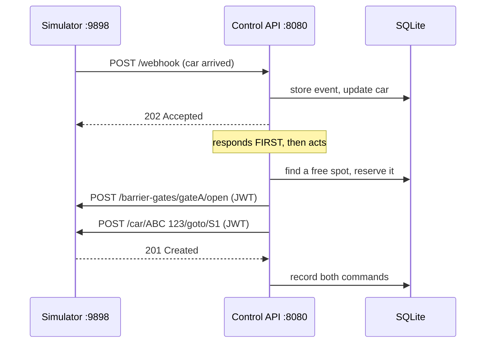

# User Guide

A walkthrough of the Grand Park Auto control system: how to start it, how a
message travels between the simulator and the application, and what every source
file does. The [README](README.md) is the quick reference; this is the
explanation.

---

## Part 1 — Starting the system

### What you need running

Three things must be alive, in this order of dependency:

| # | Component | Port | Started by |
|---|---|---|---|
| 1 | Parking Simulator | `9898` | `ParkingSimulator.exe` |
| 2 | Control API (this project) | `8080` | `npm start` |
| 3 | A loaded level inside the simulator | — | You, in the simulator window |

The API and the simulator can start in either order. The API polls for a level
every five seconds, so starting it first is fine.

### Step 1 — Start both processes

```powershell
.\start-simulator.ps1
```

This launches the simulator and the API together. The API runs hidden and writes
to `logs/listener.stdout.log`.

For development, run them separately so you can watch the API:

```powershell
Start-Process .\ParkingSimulator-win-x64\ParkingSimulator.exe -WorkingDirectory .\ParkingSimulator-win-x64
```

```powershell
npm start
```

> **Run exactly one simulator.** Only one process can bind port `9898`. If two
> are running, the one holding the port may be sitting on the menu, so every
> `list-*` call returns `[]` while the level you are watching belongs to the
> other process. Check with
> `Get-Process ParkingSimulator | Select-Object Id,MainWindowTitle`.

### Step 2 — Load Level 1

In the simulator window, load Level 1 and wait for the layout to appear.

### Step 3 — Watch the API take over

```text
Parking control API: http://127.0.0.1:8080/api/v1
Simulator webhook: http://127.0.0.1:8080/webhook
Waiting for a level to be loaded in the simulator...
Synchronized 36 spots and 3 barriers
Cleared 214 car records from the previous run
Entry barrier closing: gateA
Automatic entry, guidance and exit are running
```

Each line maps to a step in `bootstrap()` in [src/main.cjs:38](src/main.cjs#L38),
covered in Part 3.

### Step 4 — Confirm it is working

```powershell
curl.exe -s -u admin:admin http://127.0.0.1:8080/api/v1/dashboard
```

`parking.occupied` should climb from `0`. If it stays at `0`, jump to
[Part 6](#part-6--diagnosing-problems).

> **PowerShell trap.** `curl` is an alias for `Invoke-WebRequest`, which has no
> `-u` and fails with *"Parameter cannot be processed because the parameter name
> 'u' is ambiguous"*. Always type `curl.exe`.

---

## Part 2 — How messages pass

### The two directions



Two independent channels, easy to confuse:

| Direction | Transport | Auth | Audit trail |
|---|---|---|---|
| Simulator → application | Simulator POSTs JSON to `/webhook` | none (signature field only) | `GET /api/v1/events` |
| Application → simulator | Application calls port `9898` | JWT, held in memory | `GET /api/v1/commands` |
| You → application | Basic-auth REST on port `8080` | `admin` / `admin` | — |

The simulator knows where to send events from `WebhookUrl` in
`ParkingSimulator-win-x64/settings/settings.json`.

### Inbound: a webhook arriving

A real arrival payload:

```json
{
  "EventClass": "car_spot_action",
  "CarPlateNumber": "GNR 079",
  "CarType": "Normal",
  "SpotName": "ENTRY1",
  "SpotType": "EntrySpot",
  "Direction": "CarIn",
  "PlannedParkingDurationInMinutes": "4",
  "EventId": "167e8edb-4ca2-4a10-bf1d-09d34c4d855e",
  "SequenceId": 8,
  "Signature": null,
  "ServerDateTime": "2026-09-19 10:51:21"
}
```

It is handled at [src/server.cjs:104](src/server.cjs#L104):

```js
if (request.method === 'POST' && (path === '/webhook' || path === '/api/v1/webhooks/simulator')) {
  const result = events.process(await readJson(request));
  sendJson(response, result.status, result.accepted ? { received: true, ...result } : result);
  // Guide cars after the response so the simulator's webhook sender is never blocked.
  if (result.accepted && !result.duplicate) {
    Promise.resolve(events.runDispatch())
      .catch((error) => console.error(`Auto-dispatch failed: ${error.message}`));
  }
  return;
}
```

The ordering is deliberate. `sendJson` runs **before** `runDispatch`, and the
dispatch promise is intentionally not awaited. A dispatch can take seconds —
opening a gate, waiting for it to settle, issuing drive commands. Awaiting it
would hold the simulator's webhook sender open and back up the event stream.

`events.process()` at [src/event-service.cjs:39](src/event-service.cjs#L39) then
runs five checks in order:

1. **Shape** — `EventClass` and `EventId` must exist, else `400`.
2. **Signature** — `verifyWebhookSignature`. See the note below.
3. **Duplicate** — `hasEvent(EventId)` returns `200` and stops. Webhooks retry.
4. **Sequence** — `sequenceStatus()` labels the event `first`, `ok`, `gap`,
   `out_of_order`, or `duplicate_sequence`, advancing the high-water mark only
   forwards so a late event cannot rewind it.
5. **Apply** — `applyEvent()` updates the car and component state, then `202`.

> **Signatures on this build.** Ordinary `car_spot_action` events arrive with
> `Signature: null`; only `test_webhook` is signed. `REQUIRE_WEBHOOK_SIGNATURE`
> must stay `false` or every real car event is rejected with `401`. The MD5
> algorithm is implemented in [src/signature.cjs](src/signature.cjs) and tested,
> so it can be switched on when the simulator is fixed.

### The car state machine

`applyCarSpotAction()` at
[src/event-service.cjs:120](src/event-service.cjs#L120) branches on
`SpotType × Direction`. This is the heart of the system — it is what lets the
application track every car without ever re-reading the simulator:

| Event | New status | Side effect |
|---|---|---|
| `EntrySpot` + `CarIn` | `waiting_entry` | **Clears any reservation** |
| `EntrySpot` + `CarOut` | `inside` | Keeps the reservation — the car is en route |
| `Park` + `CarIn` | `parked` | Marks the spot occupied |
| `Park` + `CarOut` | `heading_to_exit` | Frees the spot **and** the reservation |
| `ExitSpot` + `CarIn` | `at_exit` | Triggers the charge on the next pass |
| `ExitSpot` + `CarOut` | `departed` | — |

The reservation clearing on `EntrySpot + CarIn` matters more than it looks. A car
that reappears at the entrance while still holding a reservation would become
invisible to `pendingCars()` (which skips cars that already have a spot) while
still blocking that spot in `findAvailableSpot()`. One spot would leak per
occurrence until all 30 were locked and the park deadlocked. That bug happened;
`test/event-service.test.cjs` reproduces it.

### Outbound: commanding the simulator

Every outbound call goes through `runCommand()` at
[src/event-service.cjs:279](src/event-service.cjs#L279), which writes an audit
row before the call and completes it after:

```js
async runCommand(action, target, operation) {
  const commandId = this.database.createCommand(action, target, 'auto-dispatch');
  try {
    const result = await operation();
    this.database.completeCommand(commandId, 'completed', result ? result.body : null);
    return result;
  } catch (error) {
    this.database.completeCommand(commandId, 'failed', null, error.message);
    throw error;
  }
}
```

This is why `GET /api/v1/commands` is the first place to look when a car does not
move — failures are recorded with their error text, not swallowed.

### Why the simulator hop is invisible to Postman

Postman is an HTTP client, not a network monitor. It can see its own requests to
port `8080`, but not the backend's calls to port `9898`, which happen inside the
Node process. Use the two audit endpoints instead:

- `GET /api/v1/events` — what the simulator sent in
- `GET /api/v1/commands` — what the application sent out

Compare timestamps across the two to follow one operation end to end.

---

## Part 3 — Startup, line by line

`bootstrap()` at [src/main.cjs:38](src/main.cjs#L38) is a retry loop:

```js
async function bootstrap() {
  for (let attempt = 1; !shuttingDown; attempt += 1) {
    try {
      const snapshot = await simulator.syncAll();
      events.storeSync(snapshot);
      const spots = (snapshot.parkingSpots || []).length;
      if (!spots) {
        if (attempt === 1) console.log('Waiting for a level to be loaded in the simulator...');
        await wait(config.bootstrapRetryMs);
        continue;
      }
      ...
```

**Why the retry.** An unloaded level does not error — it returns `200` with an
empty array from every `list-*` endpoint. Without this loop the API would sync
nothing, believe the park has zero spots, and never assign a car.

**Why `syncAll` runs only once.** The API documentation states that discovery
calls carry a simulated operational cost and should be used only once per level
load. Everything after that is maintained from webhooks. The only exception is
reconciliation (Part 4).

**Why cars are cleared.** `database.resetCarState()` at
[src/database.cjs:206](src/database.cjs#L206) deletes the previous run's car
rows. A newly loaded level has all-new cars; keeping the old rows means phantom
reservations against spots nobody is parked in. With 30 spots and 30 phantoms,
nothing can ever be assigned again.

**Why the entry barrier is closed.** Level 1 uses `gateA` for admission. It
starts closed and opens only after one car has a reserved destination. The exit
and upstream barriers keep the level's configured state.

Then `server.listen` starts the heartbeat:

```js
if (config.dispatchIntervalMs > 0) {
  dispatchTimer = setInterval(() => runDispatch('interval'), config.dispatchIntervalMs);
}
```

Webhooks already trigger a dispatch. The heartbeat covers the gap when events
pause — without it, a car stuck at the exit would wait for an unrelated event
before being charged.

---

## Part 4 — The dispatch pass

`runDispatch()` at [src/event-service.cjs:445](src/event-service.cjs#L445) is the
allocation loop. It claims the pass first:

```js
// Claim the pass before doing any work. A webhook and the heartbeat can fire
// together, and charging a car twice is a penalty.
if (this.dispatching) {
  this.dispatchAgain = true;
  return { enabled: true, deferred: true, assigned: [], failed: [] };
}
this.dispatching = true;
```

A deferred pass sets `dispatchAgain`, so the pass in flight loops once more
rather than dropping the work.

Then, in order:

### 1. Charge cars at the exit

`chargeCarsAtExit()` at [src/event-service.cjs:318](src/event-service.cjs#L318)
takes every car at `at_exit` with `payment_status: not_requested`, computes the
fee with `quoteForCar()`, calls `POST /car/{plate}/charge`, and marks it
`requested`.

The simulator releases a car once it has paid — verified directly: charging
`NVD 105` produced `payment_made` for `2.00`, and the car then drove out on its
own. So the charge call *is* the exit flow; no `leavepark` is needed.

> **`payment_made` is unreliable on this build** — roughly one event per ten
> departures. Nothing gates on it. The `/cars/{plate}/leave` endpoint does
> require it, which is why it is a manual endpoint only.

### 2. Release stale reservations

`releaseStaleReservations()` at
[src/event-service.cjs:377](src/event-service.cjs#L377):

- a car at `waiting_entry`, `heading_to_exit`, or `at_exit` loses its reservation
  **immediately** — it demonstrably is not in a parking spot;
- a car at `assigned` or `inside` is genuinely in transit and gets a grace period
  of `STALE_ASSIGNMENT_MS` (120s).

Only pre-park cars are returned to the queue; an exiting car keeps its status so
it is not dragged back in.

### 3. Reconcile if stalled

`reconcileIfStalled()` at [src/event-service.cjs:405](src/event-service.cjs#L405)
fires only when **all** of these hold: cars are queued, nothing looks free, and
the last reconcile was over `RECONCILE_INTERVAL_MS` ago. It then re-syncs from
the simulator.

This exists because cached occupancy can drift from reality — most often when a
level is reloaded underneath a running API. That produced a total deadlock: the
database reported 18 occupied spots and 36 cars at the exit while the simulator
reported an empty park and 35 cars queued at the entrance. This is a bounded
escape hatch, not polling.

### 4. Admit and guide

```js
for (const car of this.pendingCars()) {
  let spotName = null;
  try {
    spotName = await this.assignCar(car);
  } catch (error) {
    failed.push({ plate: car.plate, error: error.message });
    continue;
  }
  if (!spotName) { full = true; break; } // Nothing compatible is free.
  assigned.push({ plate: car.plate, spot: spotName });
}
```

`pendingCars()` returns cars at `waiting_entry` or `inside` with no reservation,
oldest first.

### 5. Turn away the overflow

`turnAwayOverflow()` at [src/event-service.cjs:424](src/event-service.cjs#L424)
sends cars beyond `MAX_ENTRY_QUEUE` to `leavepark`.

This is not a nicety. Without it, cars queue at the entrance indefinitely; the
entry spot overflows; and the simulator gridlocks so completely that no car can
move at all — observed with 37 cars stacked on `ENTRY1`, all gates open, and
every `goto` returning `201` while nothing moved for minutes. No API call
recovers that state; the level must be reloaded. A real car park turns cars away
when it is full, and so does this one.

---

## Part 5 — Placing one car

`assignCar()` at [src/event-service.cjs:292](src/event-service.cjs#L292):

```js
async assignCar(car) {
  const spot = this.database.findAvailableSpot(car.car_type);
  if (!spot) return null;

  // Reserve before commanding so a second pass cannot hand out the same spot.
  this.database.upsertCar(car.plate, { assigned_spot: spot.name, status: 'assigned' });
  try {
    await this.openGatesForSpot(spot);
  } catch (error) {
    console.warn(`Gates for ${spot.name} could not be opened: ${error.message}`);
  }
  try {
    await this.runCommand(
      'auto.car.assign',
      `${car.plate}:${spot.name}`,
      () => this.simulator.moveCar(car.plate, spot.name),
    );
  } catch (error) {
    this.database.upsertCar(car.plate, { assigned_spot: null, status: car.status });
    throw error;
  }
  return spot.name;
}
```

Four decisions are encoded here.

**Choosing the spot.** `findAvailableSpot()` at
[src/database.cjs:179](src/database.cjs#L179) accepts spots that are
`purpose: Park`, unoccupied, not `broken`, not `isUnderMaintenance`, not already
reserved, and type compatible. A `Normal` car takes `Any`; an `Electric` car
prefers `Electric` and falls back to `Any`.

**Reserving before commanding.** The reservation is written *before* the
simulator call. Cars arrive seconds apart, and the docs warn that sending a car
to an occupied spot may register a penalty. Reserving afterwards would let two
concurrent arrivals receive the same destination.

**Opening the gate is required.** If `gateA` cannot be opened, assignment stops
and the reservation is rolled back. The next car remains queued.

**Rolling back on failure.** If `moveCar` fails, the reservation is released and
the car returns to the queue. Otherwise a failed command would lock a spot
forever.

### Which gates open

`gatesForSpot()` uses `ENTRY_GATE_NAME`, which defaults to `gateA` for Level 1.
It does not open `gateB` or `gateC` when admitting a car.

`openGatesForSpot()` then waits `GATE_SETTLE_MS` if it actually opened something:

```js
// A barrier passes through Opening before it is Open. Sending a car at a gate
// still in motion strands it, so let the transition finish. Only the first car
// through a shut gate pays this cost; later cars see the cached Open state.
```

Only one car is assigned per gate cycle. After that car produces
`EntrySpot / CarOut`, the dispatcher closes `gateA` and waits for the `Closed`
notification before assigning the next queued car.

---

## Part 6 — Diagnosing problems

Work outward from the source of truth.

### Is a level actually loaded?

Ask the simulator directly, bypassing the application:

```powershell
$t = (Invoke-RestMethod http://127.0.0.1:9898/api/v1/auth/login -Method Post -ContentType 'application/json' -Body '{"email":"admin","password":"admin"}').token
(Invoke-RestMethod http://127.0.0.1:9898/api/v1/list-parking-spots -Headers @{Authorization="Bearer $t"}).Count
```

`0` means no level is loaded, or a second simulator owns the port. Nothing
downstream can work.

### Is the application seeing the same world?

```powershell
curl.exe -s -u admin:admin http://127.0.0.1:8080/api/v1/dashboard
```

If the simulator says 30 free spots and the dashboard says 0, the cache has
drifted. Reconciliation should repair it within a minute; force it with
`POST /api/v1/sync`.

### Did the commands succeed?

```powershell
curl.exe -s -u admin:admin "http://127.0.0.1:8080/api/v1/commands?limit=20"
```

Look for `auto.car.assign`, `auto.barrier.open`, `auto.car.charge`,
`auto.car.reject`. `status: failed` rows carry the error text.

### Did the cars actually move?

```powershell
curl.exe -s -u admin:admin "http://127.0.0.1:8080/api/v1/events?class=car_spot_action&limit=30"
```

Any event with `"SpotType": "Park"` proves a car reached a spot. Only
`EntrySpot` events means cars are being commanded but not arriving — check the
gates.

### Common failures

| Symptom | Cause | Fix |
|---|---|---|
| Every list is `[]` | No level, or two simulators racing for `9898` | Load the level; keep one process |
| `{"error":"Not found"}` at `/api/v1` or `/webhook` in a browser | No route at the bare prefix; `/webhook` is POST-only | Use `/health` |
| `EADDRINUSE` on 8080 | An older API process is alive | `Get-NetTCPConnection -LocalPort 8080 -State Listen \| ForEach-Object { Stop-Process -Id $_.OwningProcess -Force }` |
| `getaddrinfo ENOTFOUND {{controlBaseUrl}}` | No Postman environment selected | Pick it in the top-right selector |
| `'u' is ambiguous` | `curl` is `Invoke-WebRequest` | Use `curl.exe` |
| Cars assigned, never arrive | A zone gate is shut | Check `auto.barrier.open`; `POST /api/v1/dispatch?redrive=true` |
| Cars stacked at the entrance, nothing moves | Simulator gridlock | Reload the level; `REJECT_WHEN_FULL` prevents recurrence |

---

## Part 7 — File reference

| File | Lines | Responsibility |
|---|---:|---|
| [src/main.cjs](src/main.cjs) | 107 | Wiring, startup sequence, heartbeat, shutdown |
| [src/server.cjs](src/server.cjs) | 389 | HTTP routing, webhook intake, REST endpoints |
| [src/event-service.cjs](src/event-service.cjs) | 523 | Event pipeline, state machine, dispatcher |
| [src/database.cjs](src/database.cjs) | 358 | SQLite schema, spot selection, queries |
| [src/simulator-client.cjs](src/simulator-client.cjs) | 152 | JWT login, retry, typed simulator calls |
| [src/signature.cjs](src/signature.cjs) | 39 | MD5 webhook signature |
| [src/auth.cjs](src/auth.cjs) | 34 | Basic auth, timing-safe comparison |
| [src/config.cjs](src/config.cjs) | 41 | Environment parsing and defaults |
| [src/component-state.cjs](src/component-state.cjs) | 11 | Normalises `detectedCars` (array or count) |
| [src/env.cjs](src/env.cjs) | 20 | Minimal `.env` loader |

### Notable details

**`simulator-client.cjs`** holds the JWT in memory and, on any `401`, clears it,
logs in again, and replays the request once — `canRetry` prevents a loop. Every
path segment is URL-encoded, which matters because plates contain spaces
(`GNR 079` → `GNR%20079`).

**`component-state.cjs`** exists because `detectedCars` arrives as an array in
the documentation but as a plain count from this build. `detectedCarCount()`
accepts both. Without it, `(0).length` is `undefined`, every spot looks occupied,
and nothing is ever assigned.

**`database.cjs`** uses `node:sqlite` in WAL mode. Tables: `events` (raw
payloads plus signature and sequence status), `cars`, `components`, `commands`,
`metadata`. Components are stored as JSON with a `(component_type, name)` primary
key, so one table serves spots, barriers, lights, fans, alarms, and zones.

**`auth.cjs`** compares credentials with `crypto.timingSafeEqual` after a length
check, so a wrong password cannot be discovered by timing.

---

## Part 8 — Tests

```powershell
npm run check   # syntax only
npm test        # 13 tests, no simulator needed
```

Every test uses a stubbed simulator and a temporary database, so they are fast
and hermetic. Most encode a bug that actually occurred:

| Test | Guards against |
|---|---|
| idempotent car events | Duplicate webhook processing |
| auto-assign and hold when full | Regression in the core loop |
| dispatch inert without a simulator | Crashing when used as a library |
| charge at exit | Double-charging, charging before the exit |
| recovers from phantom state | The level-reload deadlock |
| closes barriers on startup | Opening gates for the wrong zone |
| no reservation leak on re-entry | The 30-spot deadlock |
| turns cars away when full | Entrance gridlock |
| `resetCarState` | Phantom cars surviving a restart |
| overlapping passes never double-charge | The webhook/heartbeat race |
| signature tests ×2 | Accepting forged or rejecting valid events |

When changing dispatch logic, run the suite first — several of these failures are
silent in production and only show up as a park that quietly stops working.
