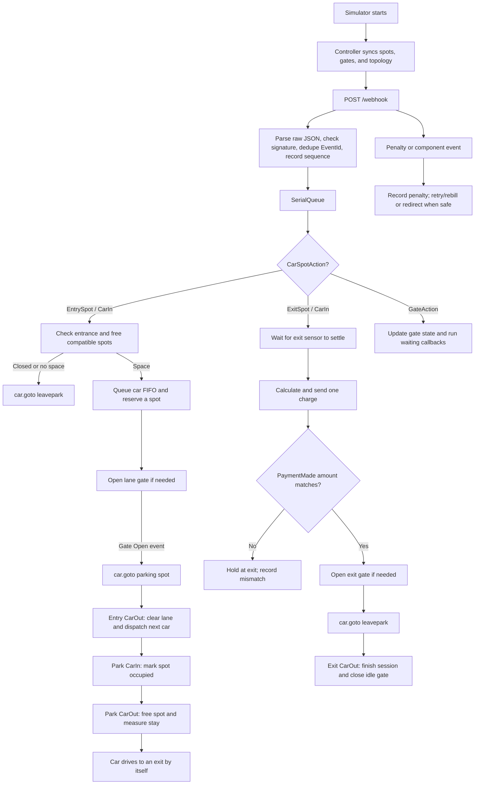

# Current Level 1 workflow

This describes the code currently on `miro_level1`. The controller processes one
webhook, timer, or manual action at a time through `SerialQueue`.

The normal state order is:

`queued → dispatching → dispatched → entering → parked → to_exit → at_exit → invoiced → released → gone`

The main exception states are `turned_away`, `neglected`, `payment_mismatch`,
`lost`, `unknown`, and `escaped` (a counter for an exit without release).

## Rule order

1. **Synchronize before acting.** On startup, the server lists parking spots and
   gates, selects the matching file in `topology/`, restores recent events and
   commands, then starts accepting decisions. If no level is loaded, it waits.

2. **Trust the webhook before using it.** The server keeps the raw JSON so the
   signature can be checked without changing numeric formatting. Level 1 sends
   `Signature: null`, so unsigned events are accepted by default. Duplicate
   `EventId` values are ignored. Sequence gaps are logged and the event is still
   put through the serial queue.

3. **Entry comes before parking.** For `EntrySpot / CarIn`, the controller:

   - turns the car away if the entrance is admin-closed;
   - counts free compatible spots and cars already waiting;
   - turns the car away with `leavepark` when no spot will remain;
   - otherwise adds it to that lane's FIFO queue;
   - reserves the first legal spot (same zone first with the default strategy);
   - waits for the lane gate to open before sending the car to the spot.

   Only one car is dispatched per entry lane at a time. After `EntrySpot /
   CarOut`, the next queued car is dispatched. An idle gate closes after a
   game-time delay.

4. **A parking sensor confirms the decision.** `Park / CarIn` changes the car
   to `parked`, records the parking time, marks the spot occupied, and clears its
   reservation. A `Park / CarOut` removes that car from the spot, records the
   end of parking, and lets the next entry use the space.

5. **Cars find the exit themselves.** The controller never sends a parked car to
   `goto exit`. It waits for `ExitSpot / CarIn`. A transient exit event while a
   car is still driving in is ignored. When a real exit arrival is detected, the
   old parking spot is freed and charging is delayed briefly so the simulator
   does not reject an early charge.

6. **Charge before release.** The default bill is planned parking minutes ×
   price per minute; electric cars use the electric multiplier. Electricity is
   currently `0` because the Level 1 feed does not report electricity used. The
   controller sends one `/charge` command. A wrong-amount or timing penalty can
   cause a bounded retry; it never blindly repeats an uncertain HTTP command.

7. **Payment must match before leaving.** A matching `payment_made` event marks
   the car paid. Only then does the controller open the exit gate and send
   `goto/leavepark`. A wrong amount leaves the car at the exit with no release
   command. `ExitSpot / CarOut` completes the session; leaving before payment is
   counted as escaped.

8. **Safety rules override convenience.** The controller refuses to operate a
   broken or maintained gate, close a gate while a car is using it, repair an
   occupied or reserved spot, or send a car to a known occupied spot. An
   occupied-spot penalty marks the spot as taken and redirects the car if a safe
   alternative exists.

9. **Timers use simulator time.** Game-time delays are divided by `timeScale`.
   The scale is selected in this order: `GPA_GAME_SPEED`, learned completed
   stays, `GameSpeedMultiplier` from simulator settings, then `1.0`. This keeps
   gate delays, charge delays, retries, and stale-car cleanup consistent at 1×
   or 5× speed.

10. **Recovery closes the gaps.** A missing event can leave a car incomplete,
    so periodic housekeeping retries timed-out dispatches, retires stale cars,
    frees their spots and lanes, and resyncs the simulator after a long silence.
    Replaying a recent event log also replays recorded commands instead of
    making a second charge or dispatch decision.

## Level 1 lane mapping

`topology/lvl1.json` currently maps:

| Lane | Gate | Zone |
|---|---|---|
| `ENTRY1` | `gateA` | `ZONE1` |
| `EXIT_EXIT` | `gateB` | `ZONE1` |

The admin can close or reopen `ENTRY1`. Operators can control gates and repairs,
but every manual action still passes the same safety checks. Admins also manage
users, resync, and configuration.

## Current limitations to remember

- If no topology file matches the live level, the controller falls back to lanes
  without gate control and logs an error. Do not use that fallback for judging.
- The controller records sequence gaps but does not stop every later event; the
  serial queue, resync, replay, and stale-car rules are the recovery mechanism.
- `chargingCost` is currently zero until the simulator exposes electricity usage.
