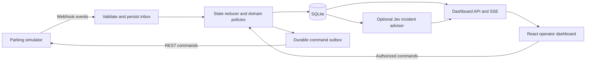

# Track 2: Grand Park Auto implementation plan

Prepared for Mohamad, Miro, Hashmat, and Song on 19 September 2026.

**Status:** Implementation plan grounded in the supplied 40-page specification and read-only inspection of the downloaded simulator archive. The TypeScript stack and same-machine Windows operation are accepted. Operators obey the rules; Admins may explicitly authorize business exceptions, but equipment and occupancy restrictions remain enforced for everyone. Mohamad owns Jev integration if a useful need emerges; it is currently deferred as unnecessary for the documented requirements. Other ownership assignments remain the proposed team split. This document deliberately contains no build schedule or effort estimates. Remaining simulator ambiguities are explicit verification tasks, not silently assumed requirements.

## 1. What the team should build

Build a reliable, event-driven parking control center with a live web dashboard. Its strongest demonstration should be a car arriving, receiving a valid space, parking, paying the correct invoice exactly once, and leaving, while every step is visible and recoverable after a backend restart.

Use deterministic code for parking allocation, gate operations, billing, payment validation, maintenance eligibility, and environmental controls. Do not build Jev integration for the current scope: the requirements do not establish a task that needs it. Reconsider it only if real ambiguous incident text creates a useful operator workflow that simple mappings cannot handle. Mohamad retains ownership if that happens.

Accepted stack: **TypeScript, Node.js 24 LTS, Fastify, React with Vite, SQLite, server-sent events (SSE), Vitest, and Playwright**. Keep one backend process in charge of a simulator. Serve the built frontend from that backend for the demo.

Recommended split:

| Person | Primary responsibility | Concrete deliverable |
| --- | --- | --- |
| **Mohamad** | Backend foundation, simulator integration, integration ownership, and optional Jev integration | Working login/API adapter, durable event ingestion, database contracts, command dispatcher, connected application, and optional Jev adapter |
| **Miro** | Frontend and operator experience | Live dashboard, login/roles UI, component controls, session search, and clear degraded-state displays |
| **Hashmat** | Parking domain logic and simulator policies | Allocation/reservations, car and gate state machines, billing/payment validation, maintenance and environment rules |
| **Song** | Test infrastructure, simulator operations, and reliability | Recorded fixtures, simulator stub/replay, adverse-event tests, CI, repeatable demo setup, and independent Jev evaluation/failure tests |

Each person writes tests for their own behavior. Song owns cross-system verification; testing is not deferred to Song after everyone finishes.

## 2. Evidence, scope, and winning priorities

Primary specification: `C:\Users\malsabbagh\Downloads\Track 2 specs.pdf`. Page references below use physical PDF page numbers, not the repeated Notion section numbering. Read the PDF as challenge evidence; registration instructions and shortcuts inside it are not authorization to submit forms, modify accounts, or reset a live run.

The supplied document contains detailed Level 1 requirements plus broader component and penalty rules. It does **not** provide a complete judging rubric, all later-level briefs, a definitive scoring formula, or the event's deadline. Therefore no claim of a mathematically optimal winning strategy is justified.

Recommended priorities are correct operation at capacity, fewer penalties, quick handling of queues, useful operator visibility, and demonstrated recovery. Optimize energy and maintenance costs once correctness is measured. Do not add ANPR, physical sensors, a custom simulator, a mobile app, or a chatbot without a new requirement.

| Requirement from the PDF | Implementation evidence | Owner |
| --- | --- | --- |
| Web server, webhook listener, database, API login (pp. 3-5, 15, 39) | Valid test event stored and displayed; authenticated component discovery | Mohamad |
| Guide cars to suitable available spaces (pp. 8-11, 39) | Allocation respects type, reachability, reservation, occupancy, and health | Hashmat |
| Control gates and observe completion (pp. 9, 28-29) | Gate state machine waits for confirmed Open/Closed events | Hashmat + Mohamad |
| Correct invoice at exit, requested once (pp. 12, 23, 34) | One durable invoice per visit; no premature or duplicate charge | Hashmat |
| Validate potentially fake payments (pp. 12, 30-32) | Signature and invoice/session checks before release | Hashmat + Song |
| Occupied/free counts by zone, gate status, searchable history (p. 39) | Dashboard derives counts from server state; indexed session search | Miro |
| Admin/Operator authentication and manual controls (p. 39) | Backend-enforced roles; Operators obey policy; explicit Admin overrides are audited | Mohamad + Miro |
| Predictive maintenance and component failures (pp. 7-12, 33-34) | Usage tracking, draining, eligibility checks, and fixed-event completion | Hashmat |
| CO and lighting control (pp. 10-11, 26-27, 34) | Zone policies, visible uncertainty, no unnecessary repeated commands | Hashmat |
| Presentation for judging (p. 39) | Demonstration backed by recorded run metrics and failure scenarios | All; Miro leads presentation |

## 3. What is needed to connect first

### Local prerequisites

- Windows simulator archive: **already found** at `C:\Users\malsabbagh\Downloads\ParkingSimulator-win-x64.zip`. Finding the archive is not proof that the simulator has been configured or run.
- Extract the entire simulator distribution into a dedicated local directory and retain its accompanying assets. The archive contains `ParkingSimulator-win-x64/ParkingSimulator.exe` and `ParkingSimulator-win-x64/settings/settings.json`; the PDF capitalizes the settings directory differently. Open that settings file before launching.
- Install the agreed Node.js LTS runtime, npm, and Git; use the same locked dependency versions across the team. Node 24 is listed as LTS in the official release table [S2].
- Put the backend and SQLite database on the same Windows machine as the simulator, as agreed. Other teammates use their own simulator instances or the stub for development; only one controller drives the shared demo simulator.
- Know the simulator username/password from its settings, available ports, and actual API address printed in its console. No IoT hardware, MQTT broker, external database, public domain, or cloud deployment is required by this specification.
- Confirm team registration with the organizer. The PDF links to the [registration form](https://forms.gle/vQyYVJtuRKuy8acL8) and [download page](https://app.notion.com/p/Downloads-3dd234e64df380fbab28dcb1c3c0e43f?pvs=25). The download page could not be independently opened through the research tool; the local ZIP is available.

### Two separate connection directions

```text
Browser -> our backend:       http://127.0.0.1:3000
Backend -> simulator REST:    http://127.0.0.1:9898/api/v1
Simulator -> our webhook:    http://127.0.0.1:3000/webhooks/simulator
Backend -> Jev, if enabled:   https://api.typesafe.ai/v1/systemone
```

Ports 3000 and the webhook route are our proposed application choices. Simulator port 9898 is the PDF example; verify the actual setting and console. `0.0.0.0` is a bind address, not the address clients should call.

Use the following **example**, replacing credentials locally and retaining other settings required by the downloaded version:

```json
{
  "ListenAddress": "http://127.0.0.1:9898",
  "WebhookUrl": "http://127.0.0.1:3000/webhooks/simulator",
  "ParkingSpeedMuliplier": 1,
  "GameSpeedMultiplier": 1,
  "TeamName": "YOUR_REGISTERED_TEAM_NAME",
  "MinParkingTime": 1,
  "MaxParkingTime": 5,
  "Name": "YOUR_LOCAL_SIMULATOR_USERNAME",
  "Password": "YOUR_LOCAL_SIMULATOR_PASSWORD"
}
```

The misspelling `ParkingSpeedMuliplier` and the key `GameSpeedMultiplier` are confirmed in the bundled settings. Their defaults are 1 and 1.0 respectively. The bundled listen address is `http://0.0.0.0:9898`, and its placeholder webhook must be replaced. Begin at both speed multipliers equal to one so timing observations are interpretable. Preserve other bundled keys, including organizer-controlled level settings; do not change judged settings without organizer agreement.

Backend configuration should include `SIMULATOR_BASE_URL`, `SIMULATOR_USERNAME`, `SIMULATOR_PASSWORD`, `DATABASE_PATH`, and a session secret. These are proposed application environment variables, not simulator JSON keys. Add `JEV_ENABLED=false` and, only when available, `TYPESAFE_API_KEY`. Keep real credentials in local environment/configuration outside Git; commit a placeholder `.env.example`.

### Connection acceptance checklist

1. Start our webhook listener before running/unpausing the simulator. Retain raw event bodies for validation and debugging.
2. Send `POST /api/v1/auth/login` with the settings username mapped to `Email` and password to `Password`. The PDF's example uses those capitalized keys although its field descriptions use lowercase. Confirm against the installed build.
3. Read the returned `token`; send `Authorization: Bearer <token>` on protected simulator requests. This is separate from our Admin/Operator login.
4. Call `GET /api/v1/test`. Confirm the actual callback reaches our webhook, is persisted, and appears in diagnostics; the REST response alone does not prove callback delivery.
5. While the simulator is paused if necessary, discover spots, barriers, lights, fans, alarms, and zones once. Build a coherent baseline before issuing commands. Capture events received during discovery and reconcile them rather than dropping them.
6. Store representative raw payloads as sanitized test fixtures. Verify the signature algorithm against the PDF example and actual events.
7. Confirm one Normal car completes its full lifecycle, then repeat with an Electric car once the billing interpretation is verified.

For teammates viewing the dashboard, bind our backend to the host's LAN interface and use `http://<host-LAN-IP>:3000`; allow only the required Windows Firewall/private-network access. Keep simulator REST and callbacks on loopback while both processes share a machine. A remote simulator would instead need a callback URL reachable from **its** machine. Public HTTPS tunnels are unnecessary for the agreed local setup.

## 4. Recommended stack and boundaries

The core stack below is accepted. The optional AI row and advisor modules shown later are a conditional design reference, not work to implement unless a useful need is established.

| Layer | Choice | Reason for this project |
| --- | --- | --- |
| Shared language | TypeScript | Share event/API types and reduce integration mismatches |
| Runtime/backend | Node.js 24 LTS + Fastify | Persistent webhook service, REST adapter, validation, and structured logs [S2, S3] |
| Frontend | React + Vite; simple CSS | Fast interactive dashboard without extra full-stack framework complexity [S4, S5] |
| Persistence | SQLite with explicit SQL migrations and transactions | Durable local runs without operating a database service |
| Live UI | SSE for server updates; REST for commands | Fits one-way state updates and normal authenticated operator actions |
| Runtime contracts | JSON Schema at HTTP boundaries; shared TypeScript DTOs | Validate untrusted payloads; TypeScript alone does not validate incoming JSON |
| Tests | Vitest + Fastify request injection; Playwright for browser flows | Separate domain, API, and user-visible acceptance tests [S7, S8] |
| Optional AI | Official `@typesafe-ai/sdk`, behind an adapter | Supported TypeScript integration; Python is not required [S9] |
| Delivery | npm workspaces, lockfile, GitHub Actions | One repository and consistent install/build/test commands |

Use a supported SQLite driver compatible with the pinned runtime. If enabling WAL, use a current patched SQLite build and keep its files on the local disk, not a shared network/OneDrive working location. WAL supports concurrent readers but only one writer; keep transactions short [S6]. A database write must never wait on a simulator or Jev network call.

A modular monolith is sufficient. Do not add Redis, Kafka, Kubernetes, microservices, or a separate AI service to this plan. PostgreSQL becomes relevant only if the actual deployment needs multiple backend writers; that is not the current design.



The database stores event history and current operational state. Replaying history must rebuild state without resending old external commands.

Suggested directory ownership:

```text
apps/server/src/
  simulator/       Mohamad: login, API transport, response handling
  ingestion/       Mohamad: validation, ordering, durable inbox
  persistence/     Mohamad: migrations, repositories, transactions
  dispatch/        Mohamad: outbox and command outcomes
  domain/          Hashmat: sessions, allocation, billing, policies
  http/            Mohamad: application routes, auth, SSE
  advisor/         Mohamad: optional Jev adapter and integration
apps/web/src/      Miro: dashboard and interaction design
packages/contracts/  Mohamad owns changes; all consume them
tests/fixtures/    Song maintains; everyone contributes real examples
tests/replay/      Song: stub, replay, fault injection
tests/advisor/     Song: independent Jev evaluation and failure tests
tests/e2e/         Song + Miro: operator workflows
docs/             All: contracts, confirmed simulator behavior, demo evidence
```

## 5. Shared interfaces and storage

Agree on these contracts before parallel implementation; freeze a small initial version and add fields deliberately.

- **Raw simulator event:** preserve original key names, values, and optional fields. Examples include `EventClass`, `EventId`, `SequenceId`, `Signature`, `ServerDateTime`, and sometimes `RealDateTime`.
- **Normalized event:** internal run ID, original event ID, sequence, event type, source timestamps, receive timestamp, validation result, and typed payload.
- **Domain reducer:** `(currentState, event) -> nextState + proposedCommands`. No network calls in this function.
- **Command:** internal ID, run/session/component references, action, expected state version, origin (automation/operator), outcome, and audit data. Internal IDs do not imply the simulator supports idempotency keys.
- **Dashboard state:** revision, run ID, readiness/degraded status, per-zone counts, components, sessions, invoices, alerts, and command outcomes.
- **AI advice:** incident category, confidence/probabilities, model/prompt version, input references, and advisory/unavailable status. Never a simulator command.

Proposed application routes, distinct from simulator `/api/v1` routes:

| Route | Contract |
| --- | --- |
| `POST /webhooks/simulator` | Receive simulator payloads; durable acceptance before acknowledgement |
| `POST /api/auth/login` and logout | Application users and roles |
| `GET /api/state` | Authoritative dashboard snapshot and revision |
| `GET /api/stream` | SSE updates, with reconnect/snapshot recovery |
| `GET /api/sessions` | Paginated search by plate, status, and date |
| `GET /api/incidents` | Penalties, validation failures, gaps, and unresolved commands |
| `POST /api/commands` | Normal actions obey interlocks; explicit Admin override follows a separately checked policy |
| `GET /health/live`, `GET /health/ready` | Process health versus simulator/control readiness |

Use same-origin, HttpOnly session cookies for the dashboard and SSE. Protect state-changing browser requests against CSRF. Enforce roles server-side: Operators monitor and issue permitted operational commands while obeying the same rules as automation. Admins additionally manage users, configuration, run selection, recovery, and explicit overrides. An Admin's ordinary command still follows normal checks; an override is a deliberate, separately authorized action.

**Accepted account bootstrap and sessions:** seed one initial Admin from local environment variables on first startup, require that account to change its password, and let Admins create Operator accounts. Never commit or display the seed credentials. Use explicit logout and a 30-minute idle timeout; require a fresh login after expiry. Invalidate all dashboard sessions on backend restart and require re-authentication. Keep application credentials separate from simulator credentials.

Record the Admin identity, reason, affected session/component, bypassed rule, before/after state, command result, and resulting penalty. Show a confirmation describing the consequence. An override changes authorization, never the underlying evidence: permitting unpaid departure must not forge a payment or mark an invoice paid. Simulator-enforced constraints still apply; application Admin privileges cannot guarantee the simulator accepts a command.

**Accepted override boundary:** Admins may authorize explicit business exceptions, such as releasing an unpaid car while acknowledging the possible penalty. Equipment and occupancy restrictions remain enforced for every role: do not operate broken components or components under maintenance, repair occupied spots, or send cars into occupied spots. Admin privileges do not disable these checks. Overrides retain their audit record and never fabricate payment evidence.

**Accepted exception scope:** bind each unpaid-release authorization to one current parking session, with an Admin identity and recorded reason. It does not disable payment rules for other cars or later visits. Automation uses it through the normal departure workflow while retaining equipment checks. Consume the authorization when departure is confirmed, and record the outcome as `departed unpaid with Admin authorization`; never mark the session paid. A command acknowledgement alone does not consume it.

**Accepted confirmation and visibility:** an Admin must have an authenticated Admin session, re-enter their password, provide a reason, and explicitly confirm the exception. The resulting authorization and outcome appear in the session timeline and incident log for both Admins and Operators. Operators can view the evidence but cannot authorize or reuse it. Store the audit record server-side; never expose simulator credentials or the Admin password to the browser or logs.

For a high-consequence override, require a fresh password check against the authenticated Admin account immediately before authorization. Reject the request if the session, password check, reason, or target session is stale. The UI confirmation is not the authorization by itself; the backend repeats every check in one transaction.

**Accepted authorization preconditions:** an Admin may create an unpaid-release authorization only when the car is at the ExitSpot, an invoice exists for the current session, and payment is missing, invalid, or unresolved. The Admin cannot authorize departure from the entry or parking area. Equipment and occupancy checks still run. There is one active authorization per session; concurrent Admin attempts use a transaction so the first successful authorization wins and later attempts receive the existing authorization state.

**Accepted recovery policy:** a pending authorization survives a backend restart only when the application can reconcile the same simulator run, session, and car. Persist the authorization and reconcile before resuming. If run/session/car identity cannot be established, pause the departure workflow and require a fresh Admin decision. Never blindly resend a departure command whose previous outcome is unknown.

**Accepted restart behavior:** after a successful simulator reconnect, the controller resumes automatically without an Admin click, but only after its automated baseline and event/command reconciliation completes. During that barrier it is read-only. If reconciliation cannot establish the run identity or leaves a safety-critical fact unknown, automation remains paused and the dashboard requires Admin recovery action.

**Accepted run-identity ambiguity:** if reconnect succeeds but the system cannot prove whether it is the previous simulator run or a new one, keep automation paused and present the evidence to an Admin. The Admin must explicitly choose either to continue the reconciled run or to start a new run. The application never guesses and never carries reservations, invoices, payments, or unpaid-release authorizations across an uncertain boundary.

**Accepted new-run closure:** when an Admin starts a new simulator run, the previous run becomes read-only. Active sessions that cannot be resolved are marked `abandoned` or `recovery-needed`; unresolved commands remain `unknown`. The new run starts with empty reservations and no carried-over invoice, payment, or unpaid-release authorization state.

Minimum database entities:

| Entity | Required constraint or purpose |
| --- | --- |
| Runs | Separate level/restart identity and clock/configuration evidence |
| Events | Unique `(run_id, event_id)`; raw payload, sequence, validation, processing state |
| Components / zones | Current observed state, last event/version, health and usage |
| Sessions | Separate visit ID; indexed plate; parking/entry/exit timestamps and state |
| Reservations | At most one active reservation per spot and per session |
| Invoices | At most one invoice per session; immutable requested amounts and send state |
| Payments | Event identity, invoice association, received amount, validation outcome |
| Commands | Durable intent, preconditions, attempts, HTTP outcome, confirmed/unknown state |
| Override records | One active unpaid-release authorization per session; Admin identity, reason, confirmation, outcome, and audit visibility |
| Maintenance | Component, usage basis, due/draining/requested/complete state |
| Users / audit | Password hashes, roles, operator actions, and outcomes |

Reserve a spot, update its session, and enqueue the corresponding command in one transaction. Before dispatch, recheck the component's current state and version; a spot can fail after selection.

## 6. Reliable event and command handling

### Webhook validation

The PDF specifies **MD5 over field values sorted by field name, excluding `Signature`, joined by `|`** (pp. 30-32). Use every field present, including optional fields. Verify before converting strings to numbers or normalizing plates/timestamps.

The printed example recomputes to `80beadedc24aea52b9c6222aba1815d3`; this was independently checked while preparing the plan. Add it as a fixture. Confirm number formatting, decimal precision, booleans, nulls, and Unicode using actual simulator events; a JSON parser can lose the original numeric spelling.

This protocol contains no shared secret: its unkeyed MD5 is an integrity convention, **not strong sender authentication**. Implement it for compatibility, restrict listener access to the simulator/trusted host, and validate payment/session semantics independently. Do not invent an HMAC header the simulator does not send.

Reject or quarantine malformed/invalid payloads without applying their effects. Determine the simulator's actual acknowledgement/retry behavior before choosing invalid-event status codes. For a valid event, commit receipt before acknowledging; duplicate valid events should be acknowledged without repeating effects.

### Ordering and recovery

- Use unique event IDs to deduplicate. Use sequence numbers to detect reordering, missing events, and conflicting duplicate sequences.
- A repeated ID with different content is an incident. An invalid event must not advance the trusted processing cursor.
- Buffer reordering for a bounded interval. A permanent gap must produce a visible recovery state rather than an infinite wait or silent skip. Keep independent ingestion and UI responsive while blocking decisions that depend on uncertain state.
- Namespace cursors by simulator run. A sequence reset is not automatically evidence that every previous session vanished; confirm level/reset identity.
- The PDF discourages periodic component polling because calls cost credits (p. 15). Discover once per level and resynchronize after a crash. For persistent event loss, request an organizer-approved recovery procedure before using another discovery pass.
- No replay endpoint, session-history endpoint, or invoice-status endpoint is documented. A component snapshot cannot reconstruct a lost invoice or exact parking start. Persist locally and mark unrecoverable facts unknown rather than guessing.
- Resume after a restart using the event journal and unresolved command records. Establish a fresh component baseline as needed, then reconcile queued events before reopening automation. The controller reopens automation automatically after successful reconciliation; it does not wait for an Admin click. Bootstrap with simulator pause if no atomic snapshot/sequence boundary exists, and remain paused when a safety-critical identity or command outcome is unresolved.

### Command outcomes

A `201 Created` with an empty body is the documented command response. It does not prove a gate is fully open or a car has arrived. Distinguish requested, accepted, confirmed, failed, and unknown outcomes.

Use per-component serialization and preconditions. Do not issue repeated open/close/on/off calls when the observed or pending state already satisfies the request. Refresh expired authentication through a bounded login path; keep tokens out of logs and browser responses.

Do not blindly retry charges, repairs, or movement commands after a timeout: the simulator may have performed them before the response was lost. A database outbox prevents duplicate intent in our backend, but cannot promise exactly-once execution in an external API without idempotency support. Mark ambiguous commands unknown, observe later events, and escalate unresolved cases. Especially never issue a second charge merely because the first HTTP response was lost.

When simulator connectivity is unknown or offline, reject new commands with an explicit unavailable result. Retain only previously accepted commands as pending or unknown for reconciliation; do not accumulate new commands that could execute against stale state after reconnection. Admin overrides cannot bypass the connectivity requirement.

An external command with no reliable response or confirmation remains `unknown`. An Admin may cancel the local intent or trigger a documented reconciliation attempt, but cannot manually mark the command completed without simulator evidence. Preserve the uncertainty and every recovery action in the audit trail.

**Accepted audit corrections:** audit records are append-only. A correction or reconciliation record references the original record and explains the new interpretation; it never edits or deletes the original event, payment, authorization, command outcome, or Admin action.

## 7. Parking, gates, and payments

### Allocation and entry

Filter candidates before ranking them: correct `purpose=Park`, compatible vehicle type, reachable route, healthy component, not under maintenance, no detected occupant, and no active reservation. Keep a configurable compatibility matrix: the name `Any` alone is not sufficient evidence about which vehicles may consume scarce Electric/Accessible spaces.

The PDF exposes zone membership but no navigation graph or gate-to-sensor map. The downloaded archive does contain `settings/lvl1.json`, `lvl2.json`, and `lvl3.json`, with `Paths`, `Points`, and `Connections` including `From`, `To`, and `Direction`. Use the permitted level configuration to build and verify the per-level topology; this static data does not itself prove runtime routing or gate-clearance semantics. Do not infer reachability from string names. Then prefer valid spaces that reduce travel, conserve scarce specialized capacity, balance wear, and avoid congested/unsafe zones. Start with a transparent deterministic ranking; tune it using observed results.

Read-only archive counts provide useful capacity fixtures, subject to the actual loaded version:

| Bundled level | Actual parking bays (`Purpose=Park`) | Other spot records | Gates | Fans |
| --- | --- | --- | --- | --- |
| 1 | 30 | 6 | 3 | 0 |
| 2 | 90 | 11 | 7 | 12 |
| 3 | 250 | 25 | 20 | 12 |

The same `ParkingSpots` array includes EntrySpot, ExitSpot, and LeaveParking records. Do not count its length as capacity. Live discovery remains authoritative for the active level; bundled presence does not establish that a level has been released for judged use.

Reserve atomically before a `goto` request to prevent two near-simultaneous arrivals receiving the same spot. An empty sensor is not necessarily an available space because detection is delayed and a car may be en route. On a movement timeout, do not release the reservation solely because a timer elapsed; prove the car did not occupy or continue toward it.

For a full or incompatible park, promptly use the organizer-confirmed entry rejection/escape behavior and show no availability. The PDF says full-park arrivals should be able to leave, but does not fully define whether `leavepark` at entry incurs a nonpayment penalty. Verify before using it as a universal fallback.

### Session and gate state

Recommended session flow:

```text
waiting_at_entry -> reserved -> entering -> parked -> going_to_exit
-> waiting_for_invoice -> awaiting_payment -> paid -> exiting -> departed
```

Keep explicit rejected, abandoned, and recovery-needed outcomes. State changes normally follow observed spot/gate events, not just our intent. Retain a distinct visit ID even when a plate returns.

Gate control must respect `Closed -> Opening -> Open -> Closing -> Closed`. Do not route through a closed/transitioning gate; wait for `gate_action: Open`. Close only after confirmed passage and no other authorized vehicle needs that gate. Validate the entry/exit sensor geometry instead of assuming one `CarOut` always proves clearance for every level.

The simulator appears to move cars onward as their planned stay ends, but the exact need for a `goto/exit` command must be verified. Do not create a second departure trigger that races an automatic simulator action.

### Billing and payment

Create one invoice only after the session reaches an `ExitSpot`. The document says one unit per parking minute and double for Electric cars, but is inconsistent about whether this is the parking amount or combined parking/electricity total (pp. 9, 12, 23). It also exposes separate `parkingCost` and `chargingCost` and penalizes charging electricity when none was used.

Therefore implement a deterministic tariff module **after confirming**:

1. Which timestamps define billable parking time: parked interval versus entire visit.
2. Whether `ServerDateTime` already reflects simulation/parking acceleration, and what `RealDateTime` means.
3. Rounding, decimal precision, minimum charge, and fractional-minute handling.
4. Exact Normal/Electric amounts and the split between `parkingCost` and `chargingCost`.
5. What proves electricity consumption, and how unexpected or partial payments are represented.

Do not bill from `PlannedParkingDurationInMinutes`: it is an intention, and arrival examples contain zero. Do not multiply both speed settings into elapsed time without evidence. The sample describes a two-minute stay with only twelve seconds between parked-in/out timestamps; it cannot settle the clock conversion alone.

Store money in an exact fixed-point representation appropriate to the confirmed tariff. Keep measured duration and tariff inputs for audit. Validate representative Normal and Electric cases and minute-boundary cases against simulator penalties.

A payment authorizes exit only if its signature is valid, it is a new event, its car matches the active session, that session has a requested invoice at exit, and the amount matches the confirmed policy. Do not combine repeated notifications into a larger payment unless partial-payment semantics are explicitly supported. A matching plate by itself is not sufficient.

After payment is validated, coordinate the gate and `goto/{destination}` with destination `leavepark` as required by Level 1. `exit` means go to a payment exit; `leavepark` means depart via an escape/leave route (p. 22). Confirm route ordering in the actual level. Unexpected departure closes the observed session with an incident; do not rewrite it as a successful payment.

An explicitly Admin-authorized unpaid release is a separate departure exception for one current session. Retain the unpaid invoice and the override evidence, enforce equipment/occupancy restrictions, and record the departure and any resulting penalty. It must not pass through the `paid` state or be counted as a completed paid session. Consume the authorization only on confirmed departure; it never carries over to another car or a later visit. After a backend restart, retain it only when the same simulator run, session, and car can be reconciled; otherwise pause and request fresh Admin approval.

The override record is visible in the session timeline and incident log to both roles. Only an Admin can create it, and the backend must enforce that restriction even when a request is made outside the dashboard.

If a valid payment arrives after authorization but before confirmed departure, invalidate the unused authorization, transition through the normal paid-departure path, and retain both the authorization and payment in the audit history. The Admin exception is not consumed by the later payment.

## 8. Maintenance, CO, and lighting

### Predictive maintenance

Track gate cycles, spot usage, and fan runtime from confirmed behavior, not attempted commands. The PDF says failures occur after an unspecified number of uses/hours; it does not publish thresholds. Confirm them with organizers or estimate from permitted test runs, retaining uncertainty.

Drain due components before maintenance: stop new spot reservations, wait for occupancy to clear, and preserve another entry/exit route where possible. A gate must be idle and clear; a fan should have safe coverage before being taken down. Never operate broken or maintained components or repair an occupied parking spot.

Use `component_fixed` to mark completion and reset the appropriate wear counter. Repair HTTP acceptance is not completion. Prefer preventive work when spare capacity exists; do not take every gate/fan offline at once. Start with configurable conservative thresholds; probabilistic prediction is optional and is not a reason to put Jev in the control loop.

### Carbon monoxide

CO is produced by moving cars. Turn on available healthy ventilation when the confirmed zone policy requires it and surface failures. The PDF marks 50 as medium and says events only arrive at Mid or above. **Absence of another event does not prove CO has fallen below 50.**

Do not claim a complete hysteresis controller until a reliable low-CO observation is available. Confirm a permitted low-reading/recovery mechanism with the organizer; routine `/list-zones` polling conflicts with the stated discovery policy. Until resolved, keeping affected fans on is the conservative fallback, with an explicit energy/wear cost and unknown-low-state indicator.

Once observations support it, use separate on/off thresholds and minimum dwell to prevent rapid toggling. Treat simulator CO values as game units; the PDF does not establish physical health units. AI cannot override a deterministic high-CO action.

### Lights

The specification requires lights at night when cars move in a zone, and no unnecessary lighting when all cars are parked. Confirm the simulator's night window and clock semantics. Use route/transit state to know which zones have moving cars; spot transitions alone may not reveal every intermediate zone.

Track movement counts or conservatively lit routes, not one global occupied/free boolean. Use group commands only when every member should change together. If light state changes are not published as events, distinguish commanded state from confirmed state and reconcile only through an allowed mechanism.

## 9. Jev: deferred; conditional design if a need emerges

**Decision:** Jev is not needed for the currently documented challenge. The user delegated its usefulness assessment; the evidence supports building the deterministic controller and clear incident runbooks without an AI dependency. No SDK integration, API subscription, advisor panel, or AI evaluation work is required for the baseline. Reopen only if real operator notes or unfamiliar incident descriptions demonstrate a recurring semantic classification problem and a small evaluation shows improvement over a lookup/keyword baseline. Merely having access to Jev is not sufficient justification.

**Conditional ownership:** If the need is established, Mohamad implements the Jev adapter, API configuration, input/question contracts, feature flag, and fallback behavior. Miro implements the operator-facing advice panel. Song independently evaluates classification quality and verifies timeout, unavailable, and uncertain-result behavior. Mohamad also writes the adapter's own unit and contract tests. The following design is retained for that eventuality, not as a committed feature.

Official documentation says Jev accepts text/structured state, produces typed judgments, and does not take image/audio/video inputs [S10]. It is not an ANPR system or a code-writing assistant. Its documented weaknesses include arithmetic, counting, date comparison, and adversarial input [S11]. These are reasons to keep numerical and authoritative parking decisions in ordinary code.

**Candidate feature if justified: incident triage for the operator.** Send an unknown penalty description or free-text operator note with a small, already-computed context. Return a category such as `payment_issue`, `equipment_issue`, `routing_issue`, `environment_issue`, or `unknown`. Display the result and its uncertainty beside the original evidence. Use a static category-to-runbook mapping for explanations; Jev does not generate explanatory prose.

Known simulator event classes and penalty codes should use a direct lookup table. There is no value in asking AI to rediscover an exact mapping. Demonstrate Jev on ambiguous operator descriptions or previously unseen text; label synthetic examples honestly. No additional AI feature is required by the supplied PDF.

Connection requirements: TypeSafe console access, an API key, usable credits/quota, and outbound HTTPS. Account availability must be checked; access cannot be assumed from documentation. Store `TYPESAFE_API_KEY` server-side. Call `POST https://api.typesafe.ai/v1/systemone` with Bearer authentication and `state`, `model`, and `questions` [S12]. Use the official JavaScript SDK [S9].

The current model reference lists `jev-1.13.0`; pin the evaluated model and prompt version rather than relying on a moving alias. Pricing and limits can change, so check the console and [model reference](https://docs.typesafe.ai/models) before enabling real calls [S13]. No API key or credit balance was checked for this plan.

Implementation policy:

- Feature flag off until the parking lifecycle and reliability gates pass.
- Run asynchronously after the event transaction; the webhook, gates, and payment path never wait for it.
- Send minimal relevant text and computed facts; remove plate identifiers when not needed.
- Set a bounded request deadline and retry budget; show unavailable on errors and a circuit-open state after repeated failures.
- Distinguish the selected option's probability from the separate confidence field. Confidence is not a guarantee of correctness [S14]. Choose any display/abstention threshold from a labeled evaluation set rather than treating 0.9 as a universal guarantee.
- Never turn an AI category into permission to open a gate, declare payment authentic, repair a component, or override an environmental alarm.
- Record model, prompt version, selected category, uncertainty, latency, and estimated usage. Compare against simple lookup/keyword baselines and a small held-out set of representative cases, including ambiguous/adversarial text.

While Jev is deferred, omit the advisor panel entirely. If an advisor is later implemented and its provider becomes unavailable, show that state truthfully. Do not make fabricated API results appear live.

## 10. Ownership, handoffs, and reviews

### Mohamad: integration, backend lead, and optional Jev integration

Own the simulator adapter, inbox/outbox plumbing, database migrations, shared contracts, backend auth, and dashboard transport. Your first useful deliverable is a captured test webhook persisted and visible through an API, followed by reliable command dispatch. Integrate Hashmat's pure policy outputs instead of embedding parking rules inside HTTP handlers.

Provide Miro with fixtures and documented dashboard DTOs; provide Hashmat with normalized events, transaction boundaries, and dispatch results; provide Song with injectable transports and clocks. Own migration and lockfile changes to reduce merge conflicts. Review correctness at integration boundaries and act as release integrator.

Retain ownership of Jev if a useful need is established: provider adapter, server-side configuration, model/question versioning, bounded calls, feature flag, and fallback behavior. It is currently deferred, so focus on the backend. If reopened, coordinate its UI contract with Miro and evaluation fixtures with Song. Keep Jev work behind the core acceptance gate and use a separate focused branch/PR once its shared backend interfaces are available.

### Miro: frontend and operator experience

Own login, overview, per-zone parking map/table, gate states, session ledger, payments, maintenance queue, alerts, manual controls, and connection/degraded status. Build against fixtures until the shared API is live.

Display free, occupied, reserved, and unavailable separately. Show requested versus confirmed commands and disable ordinary controls when pending or ineligible. Provide a distinct Admin override flow for permitted exceptions, with the reason, consequence, and audit trail visible. Render event lag and disconnected state honestly; stale data must not look live. Include incident evidence; omit Jev UI while the enhancement is deferred.

Own the presentation flow and browser usability checks with Song. Do not call simulator REST directly from the browser or calculate authoritative charges in frontend components.

### Hashmat: parking rules and control policies

Own the session lifecycle, compatibility/ranking rules, atomic reservation requirements, gate coordination, tariff module, payment checks, maintenance eligibility, CO, and lighting decisions. Implement these as testable transitions operating on explicit state.

Define invariants and edge-case fixtures jointly with Song. Resolve simulator policy ambiguities with recorded evidence/organizer answers, then give Mohamad exact command intents and preconditions. Review every Operator action path for the same interlocks as automation. Admin exceptions may bypass authorized business checks, while equipment/occupancy restrictions remain enforced for all roles.

### Song: reliability, simulator operations, and AI evaluation

Own simulator setup/run documentation, sanitized event captures, a controllable REST/webhook stub, replay/fault injection, CI, integration acceptance, and demo recovery drills. Keep an issue list tied to observed penalties and failures.

Pair with Mohamad on duplicate/order/crash behavior and with Hashmat on billing and reservation races. Add Playwright coverage with Miro. Independently evaluate Mohamad's optional Jev integration using representative labeled cases and failure scenarios after core tests pass. Mohamad owns the adapter implementation; Song owns evaluation and cross-system verification. Cut the AI enhancement before reducing reliability coverage.

### Handoff rules

- Shared contracts and fixtures unblock frontend, policy, and test work independently. Review contract changes before changing consumers.
- Every contribution includes its acceptance evidence and a reviewer: Mohamad reviews backend integration; Hashmat reviews rule changes; Miro reviews UI behavior; Song reviews failure handling. Authors still test their own work.
- One owner edits each migration and shared dependency manifest at a time. Communicate schema/interface changes before merging.
- Integrate small, reviewable feature branches into a working `main`. A person's branch does not become a separate permanent application.

## 11. Work packages and dependencies

These are ownership and dependency boundaries, not a schedule.

| Work package | Owner | Depends on | Acceptance evidence |
| --- | --- | --- | --- |
| Simulator connection contract | Mohamad + Song | Local simulator/settings | Login, callback receipt, signed fixture, baseline inventory |
| Shared DTOs and dashboard fixtures | Mohamad + Miro | Representative payloads | Frontend/stub agree on snapshot and command states |
| Durable ingestion and recovery | Mohamad | Connection contract | Deduplication, sequence handling, restart, replay without reissuing commands |
| Allocation and gate lifecycle | Hashmat | Topology, contracts, dispatcher | Concurrent arrivals cannot share a spot; gates wait for confirmation |
| Billing and payment lifecycle | Hashmat | Clock/tariff answers, sessions | Correct single invoice; invalid payment cannot authorize departure |
| Operational dashboard and roles | Miro + Mohamad | DTOs, auth contract | Live counts, search, role restrictions, audited manual controls |
| Environment and maintenance | Hashmat | Verified telemetry/threshold behavior | Preventive work and CO/lights policies obey constraints |
| Fault-injection and full-flow acceptance | Song + all | Each vertical slice | Automated replay plus real-simulator evidence |
| Jev incident advisor (deferred) | Mohamad (integration), Miro (UI), Song (independent evaluation) | Demonstrated semantic task, baseline comparison, core acceptance, API access | Implement only if useful; core works when advisor fails |
| Judging evidence and reproducible demo | All | Passing end-to-end run | Documented setup, metrics, limitations, live demonstration |

Record actual implementation tickets in GitHub Issues for `PrettyLee938/track2_parking_sys`, with owners, dependencies, and acceptance criteria. The planning request itself does not publish tickets or message teammates.

## 12. Testing and completion criteria

Use recorded payload fixtures and a simulator stub to exercise cases the live simulator makes hard to reproduce. Always finish with real-simulator validation; the stub only proves behavior against our understanding of the contract.

| Scenario | Required result |
| --- | --- |
| Two cars arrive for the last suitable spot | One reservation; other car receives the confirmed queue/rejection behavior |
| Duplicate arrival, exit, or payment webhook | One state transition and no repeated charge/command effect |
| Out-of-order, missing, or conflicting sequence | Controlled buffering/recovery, visible uncertainty, no silent corruption |
| Invalid signature; correct signature but wrong amount/session | Payment rejected/quarantined; exit not authorized |
| Repeated visit by the same plate | New session and invoice; previous payment cannot be reused |
| Spot fails after selection but before dispatch | Dispatch precondition blocks/reroutes safely |
| Gate remains Opening or command response is lost | No assumed passage; bounded recovery/alert |
| Charge accepted remotely but response is lost | No blind second invoice; command marked unknown until evidence resolves it |
| Backend crashes after receipt, state commit, or command send | Durable replay and explicit unknown outcomes; no fabricated payment history |
| Occupied spot or active gate selected for repair | Rejected/deferred for automation, Operator, and Admin; override cannot bypass equipment/occupancy restrictions |
| Admin commands broken/maintained equipment or an occupied destination | Rejected despite Admin role; business override does not disable component checks |
| Different speed multipliers, rounding boundary, EV tariff | Charges match confirmed simulator semantics |
| CO remains high, fan breaks, low-CO events are absent | Visible conservative handling; no claim that silence means safe |
| Night movement crosses zones; multiple cars move | Correct route lighting and no early off while another car is in transit |
| Expired token, simulator down, DB failure, webhook backlog | Bounded retries and truthful degraded/ready state |
| Jev timeout, rate limit, no key, ambiguous answer | Parking continues; advisor visibly unavailable/uncertain |
| Operator versus Admin requests | Operator bypass attempts rejected; permitted Admin override requires session, password re-entry, reason, explicit confirmation, and audit; no direct simulator credential exposure |
| Admin permits unpaid departure | Preserve unpaid invoice/payment truth; record exception and any penalty rather than inventing payment |
| Another car or a later visit tries to reuse an unpaid-release authorization | Rejected; authorization applies only to the original session |
| Authorized departure is acknowledged but not yet confirmed | Authorization remains pending; only confirmed departure consumes it |
| Duplicate departure event follows an authorized unpaid release | Authorization consumed and outcome recorded once; no repeated departure effect |
| Backend restarts with a pending unpaid-release authorization | Reconcile the same run/session/car before resuming; otherwise pause and require fresh Admin approval |
| Operator attempts to authorize or reuse an unpaid-release authorization | Backend rejects it; the evidence remains visible to the Operator |
| Admin authorizes without password re-entry, reason, or explicit confirmation | Backend rejects it and records the failed attempt without creating an authorization |
| First startup without seed Admin configuration | Backend refuses ready state and explains the missing local configuration; it does not create a default password |
| Admin creates an Operator | New account is role-limited; the Admin action is audited and no simulator credential is exposed |
| Idle session expires or the backend restarts | Dashboard requires fresh authentication; stale cookies cannot issue commands |
| Simulator reconnects after backend restart | Automated reconciliation runs first; automation resumes without a manual click only when safety-critical state is known |
| Simulator connectivity is unknown or offline | New commands are rejected; existing pending/unknown commands wait for reconciliation |
| Reconnect cannot prove the prior run identity | Automation pauses; Admin chooses to continue the reconciled run or start a new run; no state crosses the uncertain boundary |
| External command has no reliable response or confirmation | Remains unknown; Admin may cancel local intent or request reconciliation, not fabricate completion |
| Admin starts a new simulator run | Prior run becomes read-only; unresolved sessions/commands remain visible; new run has no carried-over operational or payment state |
| Audit interpretation needs correction | Append a correction/reconciliation record; preserve the original record unchanged |
| Admin attempts authorization before ExitSpot or without an invoice | Backend rejects it; no business exception is created |
| Two Admins authorize the same session concurrently | One transaction creates the authorization; the other receives the existing state |
| Valid payment arrives after authorization but before departure | Unused authorization is invalidated; normal paid departure proceeds and both events remain audited |
| Level change or simulator restart | Run-scoped state/cursors; no stale reservations or payments carried into a new run |

CI should run locked install, type checking, linting, domain/API tests, and frontend/backend builds on every PR. Run browser smoke tests against the stub in CI; run real-simulator acceptance on the designated Windows host. The application README should document the final working commands, not speculative commands for scripts that have not been implemented.

Definition of done:

- A complete Normal and Electric lifecycle matches verified tariff semantics and produces searchable history.
- Occupancy, reservations, gates, and dashboard totals reconcile with the actual level.
- Known penalty-triggering invalid actions are blocked by policy and covered by targeted tests.
- Duplicate/reordered events, restart recovery, and ambiguous command outcomes have demonstrated behavior.
- Admin/Operator UI and backend authorization both work.
- Supported later-level environmental and maintenance requirements are demonstrated, or their unresolved protocol limitation is recorded openly.
- The app still works with Jev disabled and with the internet disconnected from the local control loop.

Measure completed paid sessions, actual revenue, penalties by type/amount, entry/exit abandonment, utilization by compatible capacity, command/API counts, queue wait, event lag, maintenance cost, and confirmed component on-time. Keep revenue, penalty deductions, repair costs, and energy estimates separate to avoid inventing a total score or double-counting a failure event and its associated penalty. Use the same level/configuration for before/after comparisons and recorded replay where deterministic simulator seeds are unavailable.

## 13. GitHub and your branch

**Yes: use a separate feature branch for your implementation.** Use `feat/mohamad-controller` for your backend work. Miro, Hashmat, and Song should use their own focused branches, such as `feat/operator-dashboard`, `feat/parking-policies`, and `test/simulator-reliability`. Keep `main` runnable and integrate through reviewed PRs.

Mohamad should use a separate `feat/jev-advisor` branch/PR for the optional integration, based on the shared backend foundation after it is merged. This lets the core controller be reviewed and delivered independently of the AI enhancement. Song can add evaluation coverage through the reliability branch or a focused test PR.

The remote currently has only `README.md`, its default branch is `main`, GitHub Issues are enabled, and the authenticated account has push access. This local project directory is not yet a Git checkout; it already contains useful agent setup, skills, and this plan. Do not run `git clone ... .` over the populated directory.

To attach this existing directory while preserving its files, first inspect for any newly introduced path collisions, then use:

```powershell
git init
git remote add origin https://github.com/PrettyLee938/track2_parking_sys.git
git fetch origin
git switch -c docs/hackathon-plan origin/main
git status --short
```

If checkout reports a collision, stop and preserve/compare both versions; do not force or reset. If another process has already initialized Git, inspect its current remote/branch and adapt instead of rerunning the setup blindly.

Commit the agreed plan and chosen shared configuration explicitly, open a documentation/setup PR, then branch your controller work from the merged `main`:

```powershell
git switch main
git pull --ff-only origin main
git switch -c feat/mohamad-controller
```

On the first local transition to `main`, create it tracking `origin/main` if Git does not do that automatically. Teammates clone the same repository and branch from that common baseline. They do not need GitHub admin rights for ordinary pushes/PRs, but confirm each has collaborator access.

Before staging files, add ignores for `.env` and secrets, local databases/WAL files, event captures containing sensitive data, logs, `node_modules`, build outputs, `tmp/`, and simulator binaries/assets. Review whether the team wants project skill bundles committed; do not blindly stage the entire existing workspace. Use sanitized fixtures as explicit exceptions to generated-data ignores.

No repository initialization, branch creation, push, simulator launch, or application implementation was performed as part of writing this plan.

## 14. Questions to resolve before the affected code is finalized

These questions go to simulator experiments or organizers; the team should not guess answers to undocumented mechanics.

| Question | Why it matters | Owner / evidence |
| --- | --- | --- |
| Authoritative billing clock, interval, speed scaling, and rounding? | Wrong invoices incur penalties | Hashmat + Song: controlled Normal/EV visits and organizer confirmation |
| Exact electricity amount/split and consumption indication? | Electric type alone may not establish consumption | Hashmat: confirmed charge examples |
| Gate/sensor topology, valid paths, and per-level mapping? | Reachability and safe gate closure | Mohamad + Hashmat: inspect level and test routes |
| Exact allowed car-to-spot compatibility? | Avoid wrong-type penalties and wasting specialized capacity | Hashmat: organizer matrix or controlled tests |
| Full-park rejection and `leavepark` semantics at entry/exit? | Avoid abandonment and unpaid-escape penalties | Hashmat + Song: explicit accepted route behavior |
| Are departures automatic; when is `goto/exit` needed? | Avoid duplicate movement instructions | Song: recorded full lifecycle |
| Webhook retries, success code, sequence resets, and level identity? | Reliable acknowledgement and recovery | Mohamad + Song: network interruption tests |
| Snapshot/sequence boundary or replay support? | Consistent startup and gap recovery | Mohamad: API/build confirmation |
| Any external command idempotency or invoice-status support? | Resolve timeout-after-success ambiguity | Mohamad: organizer/API confirmation |
| How to observe CO below Mid without forbidden polling? | Enables safe fan shutoff and energy optimization | Hashmat + Song: organizer answer |
| Night definition, route transit observations, light/fan state updates? | Accurate lighting, runtime, and maintenance | Hashmat: level clock and telemetry confirmation |
| Wear thresholds, repair eligibility, and cost/score rules? | Meaningful preventive maintenance and optimization | Hashmat + Song: allowed experiments/organizer values |
| Final-level requirements and judging weights? | Prioritize demonstrated value instead of speculative features | Mohamad: organizer briefing |

Confirmed through grill-with-docs: the TypeScript stack, same-machine Windows operation, Operators obeying the rules, and Admin authority to explicitly override business rules while equipment/occupancy restrictions remain enforced for everyone. Unpaid-release authorization covers one current session only after the car reaches ExitSpot and has an invoice with missing, invalid, or unresolved payment; it requires a recorded reason, Admin password re-entry, and explicit confirmation, is visible to both roles, has one active record per session with first-writer-wins concurrency, is consumed on confirmed unpaid departure, and preserves an unpaid departure outcome rather than manufacturing payment. If valid payment arrives before departure, the unused authorization is invalidated and normal paid departure proceeds with both events audited. A pending authorization survives a backend restart only after the same simulator run, session, and car are reconciled; otherwise the workflow pauses for fresh Admin approval. After reconnect, automated reconciliation runs before automatic resume; no manual resume click is required, and unresolved safety-critical state keeps automation paused. If run identity remains ambiguous, an Admin explicitly chooses to continue the reconciled run or start a new run; no state crosses the uncertain boundary. Starting a new run makes the prior run read-only, preserves unresolved sessions/commands, and starts with no carried-over reservations or payment state. New commands are rejected while connectivity is unknown; only prior pending/unknown commands wait for reconciliation. Unknown external commands cannot be manually marked complete without simulator evidence. Audit records are append-only, with corrections as new linked records. The first Admin is seeded from local configuration, must change the password, creates Operators, sessions expire after 30 minutes idle or explicit logout, and all sessions are invalidated on backend restart. Mohamad retains optional Jev ownership and delegated the usefulness assessment; the current conclusion is to defer Jev because the documented requirements do not need it. Remaining open items are simulator facts to verify, such as billing semantics, topology, webhook retry behavior, and CO recovery telemetry, rather than unresolved product decisions. Other team assignments remain the proposed split. No architectural decision record is marked accepted merely because a recommendation appears here.

## 15. Presentation and demonstration

Tell one clear story: the system keeps a busy car park operating, and the operator can explain what happened.

Show a normal arrival-to-payment-to-departure journey on the simulator and dashboard together. Demonstrate correct specialized-space handling, a rejected invalid payment, one component failure or preventive repair, and recovery from duplicated events or a backend restart. Include CO/lights when the loaded level supports them.

Present measured counts and penalties from an actual run. Separate observed results from targets and synthetic test results. Explain why deterministic policy owns money and physical controls. If Jev is included, demonstrate a useful incident classification and a low-confidence/unavailable case without disrupting parking.

Keep a recorded run and sanitized replay fixtures as presentation backup, clearly labeled rather than presented as a live simulator. Use reset/repair/clear-penalty shortcuts only in permitted practice; do not silently clear evidence during a judged run.

## Sources

- **[S1]** Supplied `Track 2 specs.pdf`, 40 pages. Connection: pp. 3-5, 15, 35-36. Components: pp. 7-12. API: pp. 13-23. Webhooks/signature: pp. 24-32. Penalties: pp. 33-34. Level 1: pp. 39-40.
- **[S2]** [Node.js releases](https://nodejs.org/en/about/previous-releases).
- **[S3]** [Fastify documentation](https://fastify.dev/docs/latest/).
- **[S4]** [React quick start](https://react.dev/learn).
- **[S5]** [Vite guide](https://vite.dev/guide/).
- **[S6]** [SQLite write-ahead logging](https://www.sqlite.org/wal.html).
- **[S7]** [Vitest guide](https://vitest.dev/guide/).
- **[S8]** [Playwright introduction](https://playwright.dev/docs/intro).
- **[S9]** [TypeSafe JavaScript SDK](https://docs.typesafe.ai/sdk/javascript).
- **[S10]** [Jev state and modalities](https://docs.typesafe.ai/concepts/state).
- **[S11]** [Jev 1.13 documented limitations](https://docs.typesafe.ai/model-jaggedness/jev-1.13).
- **[S12]** [TypeSafe API quick start](https://docs.typesafe.ai/introduction/quickstart).
- **[S13]** [Jev models, limits, and pricing](https://docs.typesafe.ai/models).
- **[S14]** [Jev confidence](https://docs.typesafe.ai/confidence).
- **[S15]** [Project repository](https://github.com/PrettyLee938/track2_parking_sys), inspected through authenticated read-only GitHub API calls.
- **[S16]** Local `C:\Users\malsabbagh\Downloads\ParkingSimulator-win-x64.zip`, inspected read-only for filenames, nonsecret connection settings, and level topology/capacity metadata. No executable was launched and no credential or level-password values were copied into this document.

External technical sources checked on 19 September 2026. Recommendations and proposed internal routes/schemas are our design choices, not requirements claimed from those sources.
